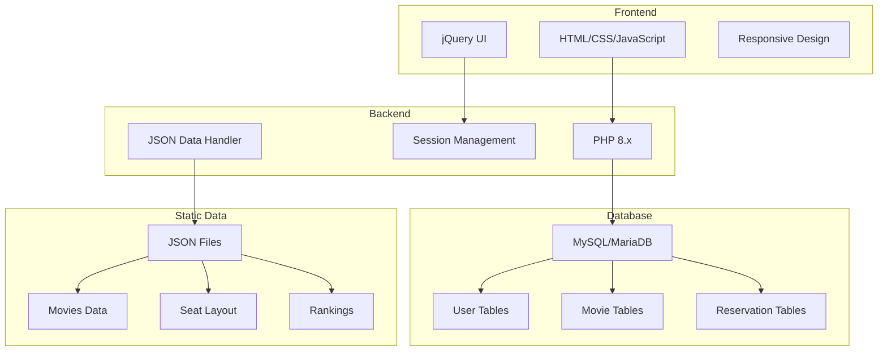

# Renewal_project_Cgv

**🔗GitHub:** [Ha-im/Renewal_project_Cgv](https://github.com/Ha-im/Renewal_project_Cgv)  
**🌐데모 사이트:** [닷홈 배포 버전](http://gungsun1.dothome.co.kr/Renewal_project_Cgv/)

---

## 📋 목차
- [프로젝트 개요](#프로젝트-개요)
- [프로젝트 정보](#프로젝트-정보)
- [팀원 구성 및 역할 분담](#팀원-구성-및-역할-분담)
- [시스템 요구사항](#시스템-요구사항)
- [기술 스택](#기술-스택)
- [폴더 구조](#폴더-구조)
- [주요 기능](#주요-기능-및-부가기능)
- [라우팅 안내](#라우팅-안내)
- [로그인 테스트 계정](#로그인-테스트-계정)
- [설치 및 실행](#설치-및-실행)
- [배포 가이드](#배포-가이드)
- [문제 해결](#문제-해결)
- [미리보기](#미리보기)
- [외부 자료 및 참고 링크](#외부-자료-및-참고-링크)
- [코드 컨벤션](#코드-컨벤션)
- [라이센스](#라이센스)

---

## 프로젝트 개요

CGV 사이트 리뉴얼 프로젝트입니다.  
PHP와 MySQL을 백엔드로 사용하며, 프론트엔드는 HTML, CSS, JavaScript(jQuery 포함)로 구현했습니다.  
영화 예매, 영화 소개, 관리자 페이지 등 주요 기능을 포함합니다.

---

## 📅 프로젝트 정보

- **프로젝트 유형**: 웹사이트 리뉴얼 (팀 프로젝트)
- **팀 구성**: 3인 팀
- **개발 환경**: XAMPP/LAMP 스택
- **배포 환경**: 닷홈 호스팅
- **브랜치**: main_php

---

## 👥 팀원 구성 및 역할 분담

| 이름     | 역할         | 담당 파트 및 설명                              |
|----------|--------------|-----------------------------------------------|
| 박경선   | 팀장 / 로그인 | 로그인 관련 전체 (세션 관리, 인증, 관리자 라우팅 등) |
| 박연미   | 기능 / 디자인 | 메인 페이지 공통, 영화 예매 페이지 구현 및 디자인     |
| 김영태   | 기능 구현    | 영화 소개 페이지 구현                           |

---

## 💻 시스템 요구사항

- **PHP**: 8.0 이상
- **Database**: MySQL 5.7 이상 또는 MariaDB 10.2 이상
- **Web Server**: Apache 2.4 이상
- **메모리**: 최소 256MB RAM
- **디스크 공간**: 100MB 이상

---

## 🛠 기술 스택

- **Language**: PHP 8.x  
- **Database**: MySQL/MariaDB  
- **Web Server**: Apache (XAMPP/MAMP/LAMP)  
- **Frontend**: HTML5, CSS3, JavaScript(ES6+) *(필요 시 jQuery/Bootstrap 사용)*  
- **Auth**: PHP 세션 기반 로그인/권한 관리  
- **Etc.**: Git & GitHub  

---

## 📂 폴더 구조

```
RENEWAL_PROJECT_CGV/  
├── .vscode/                      # VS Code 설정 파일  
├── css/                          # CSS 스타일시트 파일들
│   ├── common.css
│   ├── footer.css
│   ├── header.css
│   ├── login.css
│   ├── main.css
│   ├── movies_intro.css
│   ├── movies.css
│   ├── reservation_confirm.css
│   ├── reset.css
│   ├── signup.css
│   ├── ticket_seat.css
│   └── ticket.css
├── docs/                         # 문서 파일
├── images/                       # 이미지 파일들
├── inc/                          # PHP 공통 기능 파일들
│   ├── db_copy.php
│   ├── db.php
│   └── function.php
├── js/                           # JavaScript 파일들
│   ├── common.js
│   ├── login.js
│   ├── main.js
│   ├── movies_intro.js
│   ├── movies.js
│   ├── reservation_confirm.js
│   ├── signup.js
│   ├── ticket_seat.js
│   └── ticket.js
├── json/                         # JSON 데이터 파일들
│   ├── movies.json
│   ├── rank.json
│   ├── recommend.json
│   ├── slides.json
│   ├── ticket_seat.json
│   ├── ticket.json
│   └── upcoming_movies.json
├── media/                        # 미디어 파일
├── sql/                          # SQL 파일
├── view/                         # PHP 뷰 파일들
│   ├── index.view.php
│   ├── layout.view.php
│   ├── login.view.php
│   ├── movies_intro.view.php
│   ├── movies.view.php
│   ├── reservation_confirm.view.php
│   ├── signup.view.php
│   ├── subpage_layout.view.php
│   └── ticket_seat.view.php
├── admin_movie_update.php        # 관리자 영화 업데이트
├── admin_rank.php               # 관리자 순위 관리
├── admin.php                    # 관리자 메인 페이지
├── id_check.php                 # ID 중복 체크
├── index.php                    # 메인 페이지
├── join.php                     # 회원가입 처리
├── login_process.php            # 로그인 처리
├── login.php                    # 로그인 페이지
├── logout.php                   # 로그아웃 처리
├── movies_intro.php             # 영화 소개 페이지
├── movies.php                   # 영화 목록 페이지
├── policy.php                   # 약관 페이지
├── README.md                    # 프로젝트 설명 문서
├── reservation_confirm.php      # 예매 확인 페이지
├── signup.php                   # 회원가입 페이지
├── ticket_seat.php              # 좌석 선택 페이지
├── ticket.php                   # 티켓 예매 페이지
└── welcom.php                   # 환영 페이지
```

---

## 🎯 주요 기능 및 부가기능

### 회원 관리 시스템
- **회원가입, 로그인 (일반회원 및 관리자 구분)**
- **세션 기반 로그인 인증 및 권한 분기**

### 영화 예매 시스템
- **영화 목록 조회 및 예매 기능**
- **좌석 선택 및 예매 확인 시스템**

### 관리자 페이지
- **영화 관리, 예매 관리, 회원 관리 등**
- **영화 순위 관리 및 업데이트**

### 부가 기능
- **반응형 UI 기본 지원**
- **jQuery를 이용한 UI 인터랙션 구현**
- **JSON 기반 영화 데이터 관리 시스템**
- **좌석 선택 및 배치 시스템**
- **영화 순위 및 추천 시스템**
- **ID 중복 체크 기능**
- **메인 슬라이드 배너**
- **예매 확인 및 관리 시스템**
- **관리자 영화 업데이트 기능**
- **회원가입 프로세스 자동화**
- **약관 및 정책 페이지**
---

## 라우팅 안내

| 경로               | 설명                         | 권한 요구사항    |
|--------------------|------------------------------|------------------|
| `/login.php`        | 로그인 페이지                 | 모든 사용자      |
| `/logout.php`       | 로그아웃 처리                 | 로그인 사용자    |
| `/index.php` 또는 `/` | 메인 페이지                  | 모든 사용자      |
| `/movies.php`       | 영화 목록 페이지              | 모든 사용자      |
| `/movies_intro.php` | 영화 소개 페이지              | 모든 사용자      |
| `/ticket.php`       | 티켓 예매 페이지              | 로그인 사용자    |
| `/ticket_seat.php`  | 좌석 선택 페이지              | 로그인 사용자    |
| `/reservation_confirm.php` | 예매 확인 페이지       | 로그인 사용자    |
| `/signup.php`       | 회원가입 페이지               | 모든 사용자      |
| `/admin.php`        | 관리자 메인 페이지            | 관리자만        |
| `/admin_movie_update.php` | 관리자 영화 관리        | 관리자만        |
| `/admin_rank.php`   | 관리자 순위 관리              | 관리자만        |

---

## 🔐 로그인 테스트 계정

| 종류       | ID      | 비밀번호    | 비고                    |  
|------------|---------|-------------|-------------------------|  
| 관리자     | admin   | admin123!   | 관리자 페이지 접근 가능 |  
| 일반 회원  | 별도 회원가입 | -       | 일반 회원 메인페이지 이동 |  

---

## 설치 및 실행

### 1. 저장소 클론 및 이동  
```bash
git clone https://github.com/Ha-im/Renewal_project_Cgv.git
cd Renewal_project_Cgv
```

### 2. XAMPP 또는 Apache + PHP 환경 준비  
- `Renewal_project_Cgv` 폴더를 `htdocs` 등에 복사  
- 예시: `C:\xampp\htdocs\Renewal_project_Cgv`

### 3. 데이터베이스 생성 및 초기화  
- MySQL에서 새 데이터베이스 생성  
- `sql/` 폴더 내 SQL 파일을 사용해 테이블과 초기 데이터 적용

### 4. DB 접속 정보 수정  
- `inc/db.php` 파일에서 MySQL 접속 정보 수정

### 5. 웹서버 실행 후 접속  
- **메인 페이지**: `http://localhost/Renewal_project_Cgv/`  
- **로그인 페이지**: `http://localhost/Renewal_project_Cgv/login.php`

---

## 📦 배포 가이드

### 닷홈 호스팅 배포 과정
1. **파일 업로드**: 프로젝트 전체 파일을 FTP로 닷홈 서버에 업로드  
2. **데이터베이스 설정**: 닷홈 MySQL 환경에 맞게 DB 생성 및 초기화  
3. **설정 파일 수정**: DB 접속 정보 재설정  
4. **도메인 연결**: 도메인 또는 서브도메인 연결 후 접속 확인  
5. **최종 점검**: 권한 및 캐시 설정 점검  

---

## 🔧 문제 해결

### 자주 발생하는 문제들

**Q: 데이터베이스 연결 오류가 발생합니다**  
A: `inc/db.php`에서 호스트명, 사용자명, 비밀번호, DB명을 확인하세요.

**Q: 관리자 페이지에 접근할 수 없습니다**  
A: 관리자 계정(admin/admin123!)으로 로그인했는지 확인하고, 세션이 유효한지 확인하세요.

**Q: 이미지가 표시되지 않습니다**  
A: 웹서버의 파일 권한 설정을 확인하고, 이미지 파일 경로가 올바른지 점검하세요.

**Q: 로그인 후 페이지가 리다이렉트되지 않습니다**  
A: PHP 세션 설정을 확인하고, 브라우저 쿠키 설정을 점검하세요.

**Q: main_php 브랜치에서 작업하고 있는데 파일이 다릅니다**  
A: 올바른 브랜치에서 작업하고 있는지 확인하세요. `git branch`로 현재 브랜치를 확인할 수 있습니다.

---

## 미리보기

아래 주요 화면 스크린샷은 프로젝트 내 `/images/` 폴더에 저장되어 있습니다.

  
*메인 페이지 화면*  

  
*관리자 로그인 후 초기 화면*  

---

## 외부 자료 및 참고 링크

- **📑기획서(PPT 발표 자료)**: [Figma Slides](https://www.figma.com/slides/xhYQIPhYWHqIumk73Xyssf/%EC%82%BC%EB%8F%8C%EC%9D%B4%ED%8C%80-ppt?node-id=497-950&t=yBumxaWzbfPrf7Mg-1)  
- **🎨디자인 원본(피그마)**: [Figma 디자인](https://www.figma.com/design/cNWqo63kkdZgcqTbzLOIxy/%EC%82%BC%EB%8F%8C%EC%9D%B4%ED%8C%80-%EB%93%9C%EB%9E%98%ED%94%84%ED%8A%B8?node-id=151-92&t=mmAqOWMc5pQzQ0Ki-1)  

---

## 코드 컨벤션

- [HTML 컨벤션](docs/html.md)  
- [CSS 컨벤션](docs/css.md)  
- [JavaScript 컨벤션](docs/javascript.md)  
- [PHP 컨벤션](docs/php.md)  

---

## 📄 라이센스

이 프로젝트는 교육 목적으로 제작된 포트폴리오입니다.

---

## 📞 연락처

- **Email**: gungsun1@naver.com
- **GitHub**: [Ha-im](https://github.com/Ha-im)
- **프로젝트 Repository**: [Renewal_project_Cgv](https://github.com/Ha-im/Renewal_project_Cgv)
- **브랜치**: main_php

---

## 🎬 영화 예매 시스템 플로우

```mermaid
flowchart TD
    A[메인 페이지] --> B{로그인 여부}
    B -->|비로그인| C[로그인 페이지]
    B -->|로그인됨| D[영화 목록 조회]
    
    C --> E[회원가입]
    C --> F[로그인 처리]
    E --> F
    F --> G{권한 확인}
    
    G -->|일반회원| D
    G -->|관리자| H[관리자 페이지]
    
    D --> I[영화 상세]
    I --> J[좌석 선택]
    J --> K[예매 확인]
    K --> L[예매 완료]
    
    H --> M[영화 관리]
    H --> N[회원 관리]
    H --> O[예매 관리]
```



---

## 🏗️ 영화 예매 시스템 아키텍처


---

*Last updated: 2025*